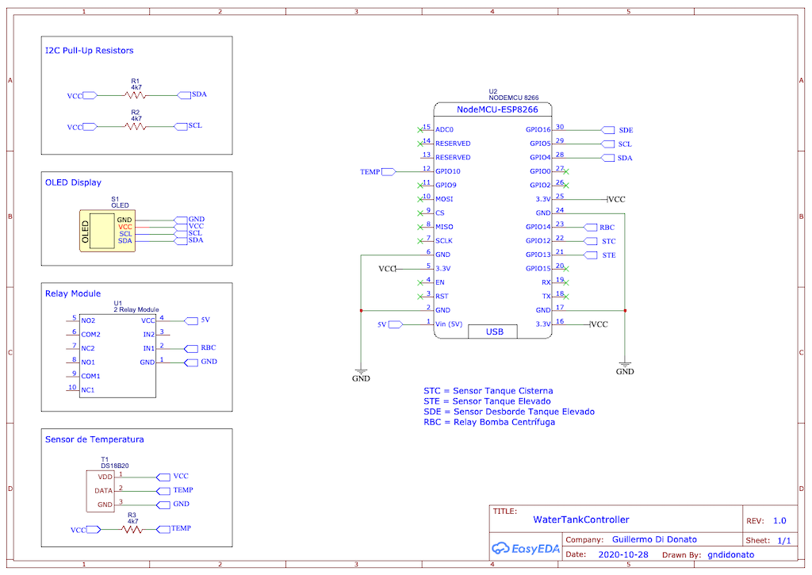

# WaterTankController
**Control** de **Tanque Cisterna**, **Tanque Elevado**, **Bomba Centrífuga** y **Temperatura** de Sala de Máquinas. Comunicación por WiFi y reporte MQTT a [Home Assistant](https://www.home-assistant.io) **#IoT** **#NodeMCU** **#ESP8266** **#HASSIO** **#MQTT** **#Water** **#Tank** **#Controller**

Este proyecto tiene como objetivo controlar el circuito de agua de una casa tradicional, utilizando sensores comerciales de nivel de líquido . Los componentes del sistema se muestran en el siguiente diagrama. 


El **WaterTankController** encenderá la Bomba Centrífuga siempre y cuando se cumplan las siguientes condiciones:

- Tanque Elevado  vacío.
- Tanque Cisterna  lleno.
- Sensor de Desborde desactivado.
- Haya pasado el tiempo entre encendidos de la Bomba, definido por programa.

Una vez activada, permanecerá encendida hasta que se cumplan algunas de las siguientes condiciones:

- Tanque Elevado lleno.
- Tanque Cisterna vacío.
- La Bomba Centrífiga haya estado en marcha más tiempo del definido por programa.

Los dos sensores flotantes de plástico sellados controlan el Tanque Cisterna y el Tanque Elevado. Debido a que el Tanque Elevado está instalado en el entretecho de una casa, por seguridad se colocó un segundo sensor por redundancia, con uno de desborde de material inoxidable. 

Para el Tanque Cisterna utilicé el sensor de nivel [Viyilant TI-Hermético](https://www.viyilant.com.ar/productos/controles-de-nivel-de-liquidos/ti-hermetico.html) *(con ángulo de corte de 45º)*, mientras que para el Tanque Elevado utilicé el modelo [Viyilant TI-Patagónico](https://www.viyilant.com.ar/productos/controles-de-nivel-de-liquidos/ti-hermetico.html), que tiene un ángulo de corte menor *(20º)*, especialmente diseñado para tanques de menor altura, como los que normalmente se colocan en los entretechosde las casas.


Una primera versión del dispositivo no tomaba ninguna decisión, sino que sólo reportaba el estado de los tanques a [Home Asstant](https://www.home-assistant.io), y por medio de automatizaciones se encendía/apagaba la Bomba Centrífuga, pero problemas con la red *(WiFi)* podían generar desbordes en el Tanque Elevado, o calentamiento de la Bomba Centrífuga *(por no parar la marcha ante falta de agua en el Tanque Cisterna)*. Por ese motivo, decidí que el dispositivo sea el controlador y que reporte el estado a Home Assistant para monitoreo y eventualmente disparar automatizaciones *(Por ejemplo, desactivar el controlador por falta de presencia en la casa).*

Uno de los puntos importantes en el código del **WaterTankController** fue conseguir la libreria "WiFi Manager" que trabaje en modo "No-Bloqueante", es decir, que si el dispositivo no logra conectarse a la red WiFi, o si pierde conexión *(por ejemplo, por problemas con el Access Point )*, siga controlando su tarea crítica *(los niveles de agua de los Tanques y la marcha de la Bomba Cisterna)*. Para eso utilicé el ["Development Branch" de la librería de tzapu](https://github.com/tzapu/WiFiManager/tree/development). De esta manera, la placa microcontroladora NodeMCU *(basada en el microcontrolador Espressif ESP8266)* se encarga de controlar los niveles de agua del Tanque Cisterna, Elevado, la marcha de la Bomba Centrífuga, y si consigue conectarse a la red WiFi y a la instancia de Home Assistant, publicará sus estados.
Caso contrario, trabajará de manera autónoma como un controlador convencional.


## Descripción Funcional

La primera vez que se enciende el dispositivo, se coloca en "Modo Acces Point", con SSID "**WaterTankController**". Desde cualquier dispositivo cliente WiFi *(teléfono, tablet, Notebook)* deberemos conectarnos a esa red, y una vez establecida la conexión, normalmente el dispositivo presentará una página como la que se muestra en la captura de pantalla Nº 2 . En caso de que la redirección no sea automática, deberemos apuntar el Navegador a la IP 192.168.4.1.


Seleccionando el botón "Configure WiFi", el **WaterTankController** realizará un "escaneo" de las redes WiFi disponibles, y mostrará en pantalla el resultado, como puede verse en la captura Nº 3. En ese momento seleccionaremos la red WiFi a la que queremos que el **WaterTankController** se conecte, e ingresamos la clave o "Password". 

Una vez cargados los datos, al guardarlos por medio del botón "Save", el dispositivo se reiniciará, y si logra conectarse la red WiFi especificada, comenzará a enviar los datos a la instancia de Home Assistant que se le haya configurado en el programa *[(ver Firmware más abajo)](Configuración del Firmware del WaterTankController)*.

A partir de ese momento, y con el Home Assistan configurado *[(ver configuración de Home Assistant)](Configuración de Home Assistant)*, podrá verse el estado del circuito de agua de la casa en el Dashboard correspondiente, tal como se muestra en la siguiente imagen:


Para tener información del estado de los componentes del circuito de agua de manera local, el dispositivo cuenta también con una pantalla OLED.


## Diagrama de Conexionado Eléctrico

El dispositivo controla la Bomba Centrífuga por medio de un Módulo Relay, activando la bobina de un Contactor *(Normal-Abierto)* para Riel DIN.

En mi caso utilicé un Contactor modular bipolar monofásico marca BAW *(modelo [CM25-20M](http://bawelectric.com/producto_detalle.php?categoria=354&producto=2597))* de 25A con bobina de 220V, pero podría utilizarse cualquier otro contactor que soporte la carga de la Bomba Centrífuga utilizada. La bomba centrífuga que utilicé es una [Pedrollo CPm-130](https://www.pedrollo.com/public/allegati/CP%200.25-2.2%20kW_ES_50Hz.pdf).


## Esquemático y PCB del WaterTankController

El esquemático del dispositivo está diseñado y [publicado con Licencia GPL 3.0 en EasyEDA](https://easyeda.com/gndidonato/watertankcontroller).




A continuación el listado con el detalle de los componentes del esquemático.

| Name           | Designator | Footprint       | Quantity |
| -------------- | ---------- | --------------- | -------- |
| OLED           | S1         | OLED            | 1        |
| 4k7            | R1,R2      | R0603           | 2        |
| 2 Relay Module | U1         | 2_RELAY_MODULE  | 1        |
| NODEMCU 8266   | U2         | NODEMCU ESP8266 | 1        |
| DS18B20        | T1         | DS18B20         | 1        |


Actualmetne el dispositivo está armado en una placa experimental. El diseño y armado del PCB es una de las [tareas pendientes](Tareas Pendientes y mejoras planeadas para el proyecto).


## Configuración del Firmware del WaterTankController

El proyecto está desarrollado en [VSCODE/PlatformIO](https://platformio.org), e incluye todas las librerías necesarias para su compilación en el directorio `/lib`. Es decir, con sólo descargar *(o clonar)* el proyecto y editar el nombre de un archivo, debería compilar sin errores.

Una vez en la carpeta local del proyecto, cambiarle el nombre al archivo que se encuentra dentro del directorio `/include` de `mqtt.configuration.example.h` a `mqtt.configuration.example.h` *(sólo hay que borrarle "example).*

El contenido del archivo `mqtt.configuration.example.h` es el siguiente:

````c++
// Replace with your credentials
\#define MQTT_USER "mqttuser"
\#define MQTT_PASSWORD "mqttpassword"
\#define MQTT_CLIENTID "WaterTankController"
\#define MQTT_SERVER_IP 192, 168, 1, 10
\#define MQTT_SERVER_PORT 1883
\#define MQTT_TOPIC  "WaterTankController/State"

````

Sólo resta editar el archivo con los datos del Broqker MQTT que tenga instalada la instancia de Home Assistant donde reportará el **WaterTankController** *(normalmente Mosquitto)*, compilar el proyecto y descargarlo al NodeMCU por medio de un cable USB.

En resumen, los pasos a seguir para compilar e instalar el **WaterTankController** en la placa microcontroladora son los siguientes:

- Descargar el código del proyecto *(o clonarlo en el directorio deseado)*.
- Cambiarle el nombre al archivo que se encuentra dentro del directorio `/include` de `mqtt.configuration.example.h` a `mqtt.configuration.example.h` *(sólo hay que borrarle "example)*.
- Editar el archivo colocándole las credenciales de MQTT del Broker al que se desea conectar el dispositivo.
- Compilar el proyecto.
- Descargarlo a la placa NodeMCU por medio de un cable USB.


## Configuración de Home Assistant

Para que Home Assistant reciba los datos enviados por WaterTankController y los procese corectamente, es necesario definir el dispositivo en su archivo `configuration.yaml`. Esto puede realizarse de distintas maneras, en mi caso, utilizo el "File Editor" que viene incluido en la interfaz de Home Assistant.

Debajo de la última entrada del archivo `configuration.yaml`, hay que agregar el siguiente código:


```yaml
# WaterTankController
sensor 3:
  - platform: mqtt
    name: "Estado"
    state_topic: "WaterTankController/State"
    value_template: "{{ value_json.estado }}"
  - platform: mqtt
    name: "Bomba Centrífuga"
    state_topic: "WaterTankController/State"
    value_template: "{{ value_json.BC }}"
  - platform: mqtt
    name: "Tanque Elevado"
    state_topic: "WaterTankController/State"
    value_template: "{{ value_json.TE }}"
  - platform: mqtt
    name: "Tanque Cisterna"
    state_topic: "WaterTankController/State"
    value_template: "{{ value_json.TC }}"
  - platform: mqtt
  - platform: mqtt
    name: "Sensor Desborde"
    state_topic: "WaterTankController/State"
    value_template: "{{ value_json.D }}"
  - platform: mqtt
    name: "Temperatura"
    state_topic: "WaterTankController/State"
    unit_of_measurement: '°C'
    icon: mdi:thermometer
    value_template: "{{ value_json.T }}"
```


## Tareas Pendientes y mejoras planeadas para el proyecto

- Hacer el PCB del WaterTankController.
- Actualizar el código del Firmware para que el Sensor de Desborde sea opcional.
- Incluir en el Firmware un "Modo-Debug", mediante el cual  pueda configurarse si envía información de depruración al puerto serie, así como información adicional en el JSON que se envia por MQTT a Home Assistant *(Uso de memoria, Uptime, etc.)*.
- Agregar capturas de la pantalla OLED con los distintos estados del dispositivo.


## Licencia

[WaterTankController ](https://github.com/gndd/WaterTankController)by [Guillermo Di Donato](https://guillermodidonato.com/#about) is licensed under [GNU GPL 3.0](https://www.gnu.org/licenses/gpl-3.0)


[](https://www.gnu.org/licenses/gpl-3.0)

